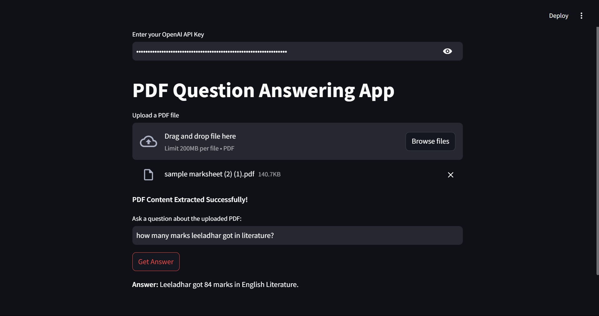

# PDF_QA_APP
This app can answer questions from the pdf using LLM

- This Streamlit app allows users to upload a PDF file, extract its content, and ask questions about the content. The app uses OpenAI's GPT-3.5-turbo model to answer questions based on the context of the uploaded PDF.

## Features
- Upload a PDF file directly through the web interface.
- Extract text from the PDF using pdfplumber.
- Interact with OpenAI's GPT model to answer questions based on the PDF content.
- Securely input your OpenAI API key through the app.

## Steps to follow:
- Enter Your OpenAI API Key:

Securely input your OpenAI API key in the provided text box. Ensure you have an active OpenAI subscription.
- Upload a PDF File:

Use the Upload a PDF file section to upload your document. Only .pdf files are supported.
- Ask Questions:

Type your question in the text box related to the uploaded PDF.
Click Get Answer to receive a response based on the PDF content.
- View the Response:

The app will display the answer from OpenAI.

## OUTPUT:

